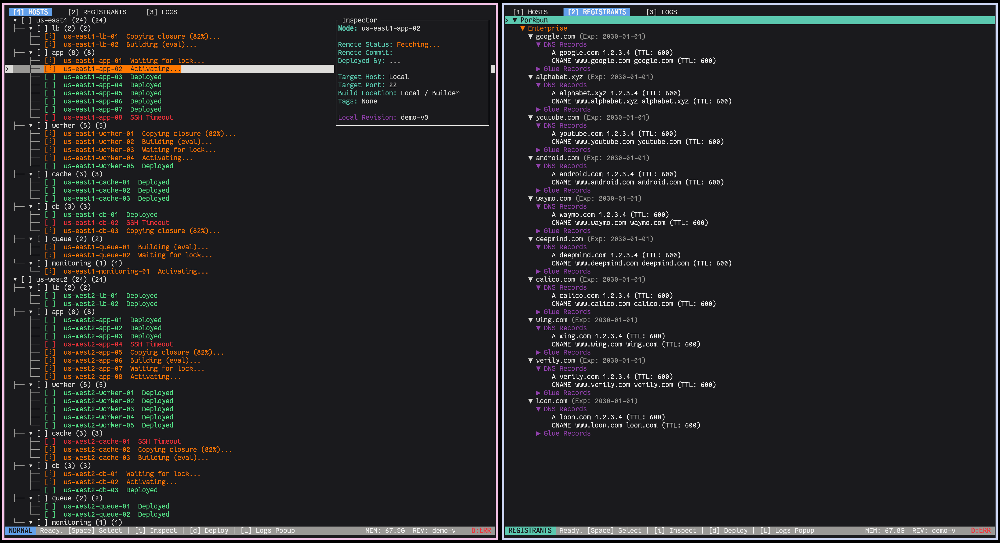

# Navi
> [!WARNING]
> **Active Development Access**: Navi is currently in an early stage of
> development.  Features, commands, and configuration formats are subject to
> breaking changes without notice. Use with caution. THIS GOES FOR THIS README
> AS WELL.

> [!CAUTION]
> **Security Notice**: This tool is currently experimental. Do not use with production API keys or on multi-user systems, as credential handling is not yet hardened.



Navi is a specialized deployment tool for NixOS, forked from Colmena. It extends
the core deployment capabilities with a persistent daemon architecture,
integrated infrastructure provisioning via Terraform/Terranix, and a
comprehensive terminal user interface (TUI) for managing large-scale fleets.

## Overview

While retaining full compatibility with standard Hive configurations, Navi
introduces a client-server model to manage deployment state and locks more
effectively. It bridges the gap between infrastructure provisioning and system
configuration by integrating Terraform directly into the deployment workflow.

## Key Features

### Interactive Terminal Interface
Navi provides a TUI (`navi tui`) for real-time fleet management:
* **Hierarchical Node View:** Organize nodes by category, environment, or hostgroup.
* **Live Monitoring:** View real-time logs, RAM usage, and active tasks across the fleet.
* **Interactive Deployment:** Select specific nodes or groups for deployment, garbage collection, or local application directly from the interface.
* **Remote Inspection:** View node metadata, including IP addresses, tags, and git revision status.
* **Log Management:** Aggregate and filter logs from local and remote operations.

### Infrastructure Provisioning
Navi integrates with Terranix to manage underlying infrastructure before deploying NixOS configurations:
* **Unified Config:** Define Terraform resources alongside NixOS configurations
  in the same Hive.
* **Lifecycle Management:** Commands to plan, apply, and destroy infrastructure
  (`navi provision`).
* **NixOS Anywhere Integration:** Automatically bootstrap fresh machines after
  infrastructure provisioning.
* **State Synchronization:** Automatically manages Terraform lock files and
  captures outputs as persistent facts.
* **Cloud Integration:** Native support for Google Cloud Platform (GCP),
  including authentication handling and IAP tunneling.

### Advanced Deployment Capabilities
* **Daemon Architecture:** A background service manages connections and task
  queues, preventing race conditions and allowing for detached operations.
* **Disk Unlocking:** dedicated commands (`navi disk unlock`) to unlock
  encrypted ZFS pools remotely, including support for unlocking via SSH in
  initrd.
* **Provenance Tracking:** Automatically writes deployment metadata (git commit,
  deployer identity, timestamp) to `/etc/navi/provenance.json` on target hosts.
* **Smart Diffing:** Compares local closures against remote systems using `nvd`
  to provide granular package-level diffs before deployment.
* **Registrant Integration:** Fetches DNS and Glue record status from providers
  like Porkbun and Namecheap.

## Installation

Navi is a Nix flake. You can run it directly:

```bash
nix run github:cafkafk/navi
```

Or install it into your profile:

```bash
nix profile install github:cafkafk/navi
```

## Configuration

Navi uses the standard Hive format but adds several `meta` options for its specific features.

### Infrastructure Provisioning

You can define provisioners in `meta.provisioners` and assign them to nodes:

```nix
{
  meta = {
    nixpkgs = <nixpkgs>;

    provisioners.gcp = {
      type = "terranix";
      configuration = ./terraform/gcp.nix;
    };
  };

  defaults = {
    deployment.provisioner = "gcp";
  };

  # ... node definitions
}
```

### Disk Unlocking

Configure remote unlocking for encrypted hosts:

```nix
{
  nodes.web-01 = {
    deployment.unlock = {
      enable = true;
      port = 2222; # Initrd SSH port
      user = "root";
      # Command to run on the remote host to unlock
      remoteCommand = "zfs load-key -a && killall zfs";
    };
    # ...
  };
}
```

## Usage

### Standard Deployment
Navi retains the standard CLI arguments for compatibility:

```bash
# Apply configuration to all nodes
navi apply

# Apply to specific nodes
navi apply --on web-01,web-02
```

### TUI Dashboard
Launch the interactive dashboard:

```bash
navi tui
```

### Provisioning
Manage infrastructure resources:

```bash
# Provision infrastructure for specific nodes
navi provision --on web-01

# Unlock disks on remote hosts (useful after reboot)
navi disk unlock web-01

# Provision infrastructure without installing NixOS
navi provision --on web-01 --skip-install
```

### SSH Management
Navi wraps the standard SSH client but adds fleet awareness:

```bash
# SSH into a node
navi ssh web-01

# Remove host keys for a specific node (e.g., after re-provisioning)
navi ssh web-01 -R

# Remove host keys for a group of nodes
navi ssh -R --on "web-*"
```

### Daemon Management
Navi automatically spawns the daemon when needed, but it can be managed manually:

```bash
# Check daemon status
navi daemon status
```

## FAQ

### Why is this named navi?

It's not a blue alien, an e-sport team, a bike, or a companion in legend of
Zelda. It's a reference to the NAVI computer - the Knowledge Navigator - in
Serial Experiments Lain, that runs Copland OS (which in itself is a reference
to early apple computers).

Over the season, the machine evolves from a simple, portable device into a
house consuming system of tubes, wires, and fluids. Much like this program.

Here's a link to see it: [Navi Progression: Serial Experiments Lain (youtube)](https://www.youtube.com/watch?v=UdXHdAPHVWE&t=2s)

### Why not use a deployment tool as an input?

Deep native integration. If I'd just have consumed it indirectly, I'd not have
the nescesarry control over the internal. Further, I've always wanted my own
deployment tool, and I know that there is a lot to be gained here from a tight
integration.

Heck, I've pondered subsumming several other tools, but I've held off... for
now.

### Where is the documentation?

As of right now, the source code is the documentaion. That's partially just
because I don't have time to write it, but equally so that I don't have time to
update it.

I'm personally also at a point in my life where it's easier to just read the
source code than to try and read old outdated documentation, and I'd recommend
others do this.

### Will you support xyz provider?

Maybe, but prerequisite to asking this, please provide me with the funding to
test against those providers.

### Why should I use this instead of xyz?

You really shouldn't. Please don't.


<br>
<br>
<br>
<br><br><br><br><br><br><br><br><br><br><br><br><br><br><br><br><br><br><br><br><br><br><br><br><br><br><br><br><br><br><br><br><br><br><br><br><br><br><br><br><br><br><br><br><br><br><br><br><br><br><br><br><br><br><br><br><br><br><br><br><br><br><br><br><br><br><br><br><br><br><br><br><br><br><br><br><br><br><br><br><br><br><br><br><br><br><br><br><br><br><br><br><br>

<!-- Software doesn't have to be boring. Let's make more things that aren't boring. Please. -->

<p align="center">
  
</p>
